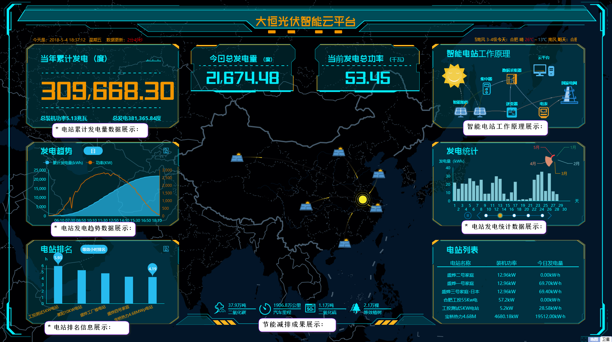
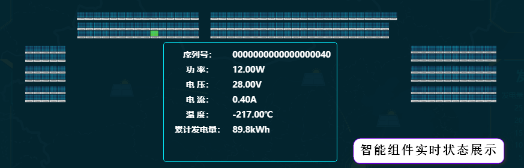
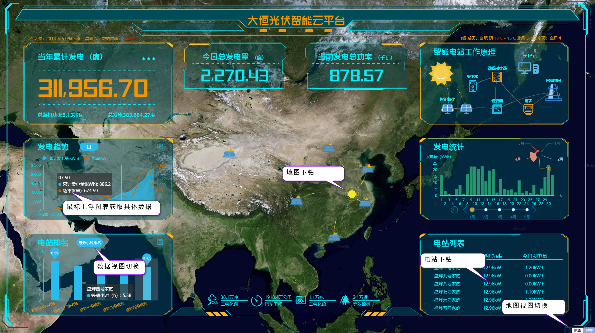
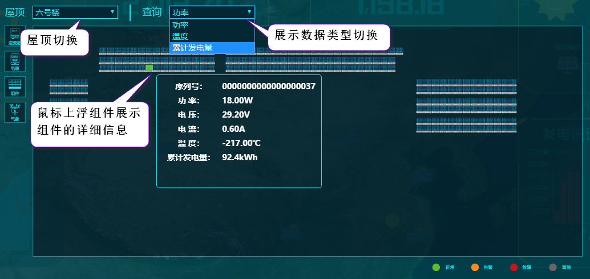

# 数据可视化平台使用介绍

> 随着运营电站增加以及运营周期的延长，云平台维护的数据量每天都在增长；面对不断激增的数据，除了精准分析，我们还希望可以将分析结果以直观的方式展示出来；

* 可视化整体分为四个部分
    + 电站关键数据展示
    + 智能电站工作原理展示
    + 智能组件实时状态展示 
    + 节能减排成果展示

### 电站关键数据展示

* 集团电站年累计发电量
* 集团所属电站发电趋势
* 集团所属电站排名
* 智能电站工作原理展示
* 发电统计
* 电站信息列表

### 操作演示

* 电站下钻
* 地图下钻
* 地图视图切换
* 图表操作
    + 数据视图切换
    + 鼠标上浮获取具体数据
* 组件布局图操作

